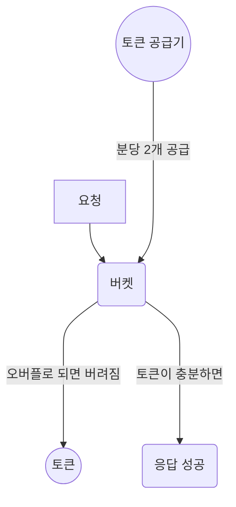
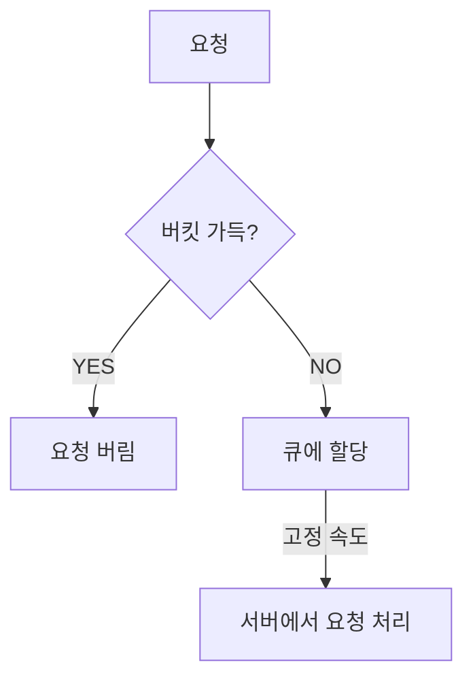
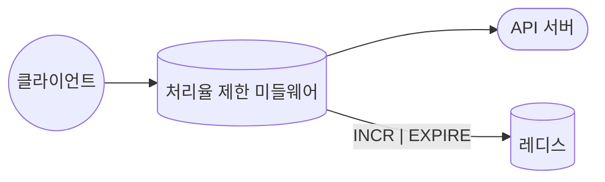
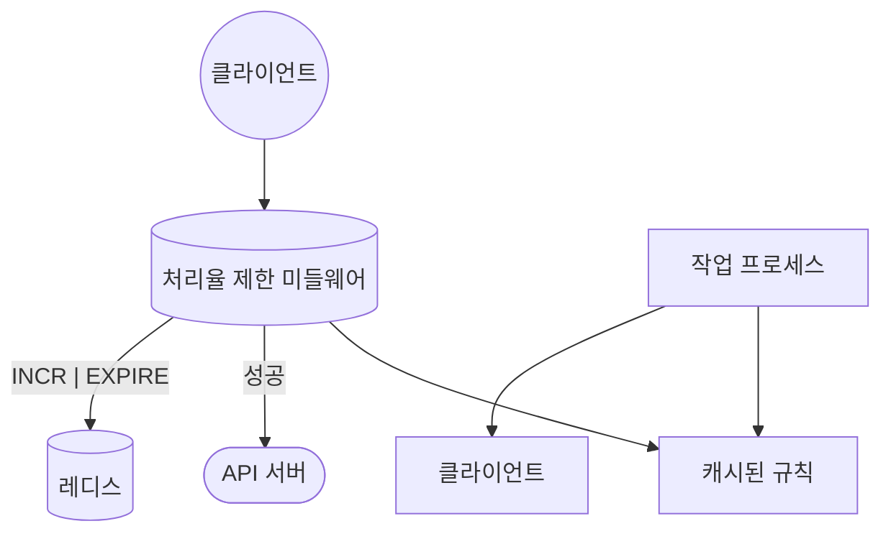

## 처리율 제한 장치
- 클라이언트 또는 서비스가 보내는 처리율을 제어하기 위한 장치
- 처리율 임계치를 초과하면 모든 호출은 중단
- 대부분의 API들은 처리율 제한 장치를 가짐
## 필요 이유
- DoS 공격에 의한 자원 고갈 방지
- 비용 절감
## 처리율 제한 장치 도입 시 고려사항
1. 종류 : 클리언트, 서버 중 어디에 위치시킬지
	- 보통은 서버 측에 둠 <- 클라이언트측은 위변조가 가능해 안정성이 떨어짐
2.  제한 기준 : 클라이언트 IP, 사용자 ID 등
	- 단일 기준이 아닌, 여러 기준을 가질 수도 있음
3. 분산 여부
4. 처리율 제한 장치의 독립성 여부
5. 처리율 제한에 대한 응답 여부

## 처리율 제한 알고리즘
### 토큰 버킷 : token bucket

- 각 요청은 처리될 때마다 하나의 토큰 소모
- 통상적으로 엔트포인트마다 별도의 버킷을 둠

장점
1. 구현이 쉬움
2. 메모리 사용에 효율
3. 짧은 시간 집중되는 트래픽 처리 가능

단점
1. 버킷 크기와 토큰 공급률을 적절히 튜닝하는게 까다로움
### 누출 버킷 : leaky bucket
요청을 버킷 큐에 담고, 버킷 큐가 가득차면 제한

장점
1. 큐의 크기 제한 -> 메모리 사용량 효율적
2. 고정된 처리율 -> 안정적 출력
단점
1. 단시간에 많은 트래픽 -> 큐에 요청 쌓임
### 고정 윈도 카운터 : fixed window counter
타임라인을 고정된 간격의 윈도로 나누고, 각 윈도마다 카운터를 붙임
-> 요청이 접수될 때마다 카운터+1
-> 임계치 도달 시, 새로운 윈도가 열릴 때까지 요청 버려짐

장점
1. 메모리 효율
2. 이해 쉬움
3. 특정한 트래픽 패턴을 처리하기 적합? 

단점
1. 윈도 경계 부근에 일시적으로 트래픽 몰리면, 기대 한도보다 많은 양의 요청을 처리
### 이동 윈도 로그 : sliding window log
- 고정 윈도 알고리즘의 문제점
	- 윈도 경계 부근에 트래픽이 집중될 때 많은 요청을 처리하게 됨
->  요청의 타임스탬프를 추적
- 새 요청이 오면 만료된 타임스탬프 제거 및 새 요청의 타임스탬프를 로그에 추가
- 로그의 크기가 허용치보다 작거나 같으면 처리. 아니면, 거부

장점
1. 허용되는 요청 개수가 시스템 처리율 한도를 넘지 않음
단점
1. 메모리 오버헤드 ( 거부된 요청의 타임 스탬프도 보관하니까 )

## 카운터 관리
엔트포인트 별 API 요청 횟수를 관리해야 하는데, 어떻게 관리할지 ?
-> 보통 레디스를 많이 사용함
- 레디스 사용하는 이유
	- DB는 너무 느림 (초 단위로 제한한다면, 그 만큼 DB 접근이 많아짐)
	- INCR 명령어 지원 : 메모리에 저장된 카운터 값 1 증가
	- EXPIRE : 카운터에 타임아웃 설정

## 설계 예시

## 분산 환경에서의 문제
### 경쟁 조건 Race Condition
- 보통은 락을 이용 -> 하지만 성능이 상당히 저하 -> 루아 스크립트, 정렬 집합(레디스 자료구조) 사용
### 동기화 이슈 Sychronization
- 처리율 제한 장치 서버를 여러 대 두면, 동기화 필수 -> 고정 세션을 활용 -> 확장성, 유연성이 낮음
## ETC
- 경성 처리율 제한
	요청의 개수는 임계치를 절대 넘지 못함

- 연성 처리율 제한
	요청 개수는 잠시 동안 임계치를 넘을 수 있음